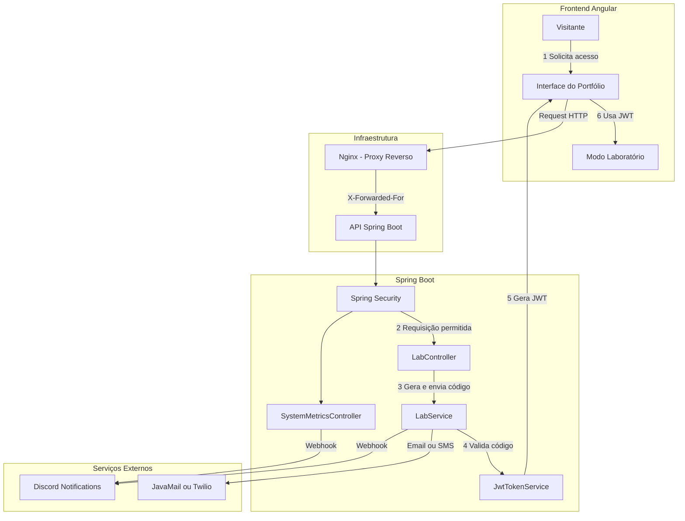

## Backend Java - Portfolio Lab API  
### Spring Boot & Cloud Infrastructure

### Esta API é responsável por autenticação via código temporário, métricas de uso do sistema e integração com serviços externos como e-mail, SMS e Discord.

Utilizada no **Modo Laboratório** do site de portfólio para validar acesso, testar endpoints e monitorar métricas e interações reais de usuários que interajam com o laboratório.

<p align="center">
  
  
  
  
  
  
</p>

<p align="center">
  
</p>

---

## 🧠 Diagrama — Fluxo do Backend



---

## 🛣️ Endpoints da API

| Endpoint | Método | Proteção | Função |
|--------|--------|----------|--------|
| `/cv-download` | `POST` | Público | Registra download do currículo e captura IP real via `X-Forwarded-For`. |
| `/send-code` | `POST` | Público | Dispara código OTP via SMS (Twilio) ou E-mail. |
| `/verify-code` | `POST` | Público | Valida código OTP e retorna JWT. |
| `/test-template` | `POST` | JWT | Endpoint protegido para testes no Modo Laboratório. |

---

> ⚠️ O envio de código via SMS está restrito ao ambiente de testes, pois o serviço Twilio está em modo *trial*.


---
## 🔐 Monitoramento e Verificação

### Código de Verificação (Email / SMS)

<p align="center">
  
  
</p>

---

### Notificações de Acesso — Email

<p align="center">
  
  
  
</p>

---

### Notificações de Acesso — Discord

<p align="center">
  
  
  
</p>

---

## 🔒 Segurança Aplicada

- Autenticação baseada em **OTP com tempo de expiração**
- Emissão de **JWT assinado**
- Separação clara entre **endpoints públicos e protegidos**
- Captura de IP real via **Proxy Reverso (Nginx)**
- Bloqueio de acesso ao Modo Laboratório sem token válido

---

## 🌍 Localização por IP

A partir do IP real capturado via proxy reverso, a API consulta:

- http://ip-api.com/json/

Para obtenção de localização aproximada do usuário.

---

## ▶️ Executando Localmente (Docker)

```bash
docker compose up -d
```

Pré-requisitos:
- Docker
- Docker Compose

---

## 🛠️ Tecnologias Utilizadas


---

## 🧭 Roadmap

- Rate limit por IP no fluxo OTP
- Cache de métricas
- Dashboard interno para visualização de métricas
- Integração com observabilidade (ex: Prometheus)

---

## 🔗 Link do Site

👉 <a href="https://antonioafj.dev/" target="_blank" rel="noopener noreferrer">
https://antonioafj.dev/
</a>
