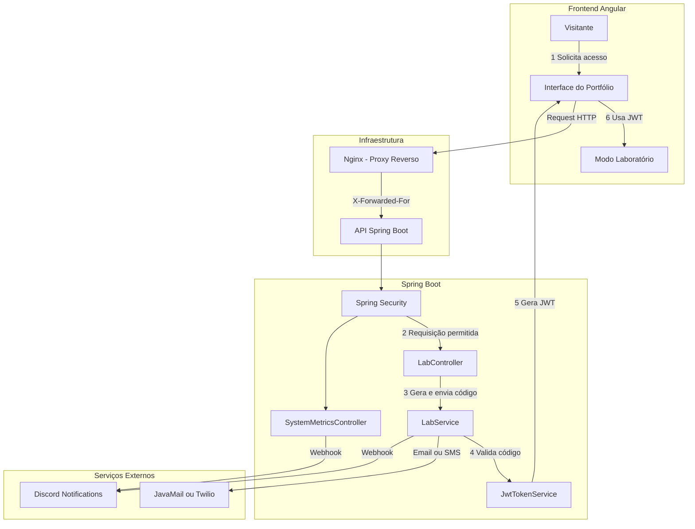

## Backend Java - Portfolio Lab API - Spring Boot & Cloud Infrastructure.

### Esta API é responsável por autenticação via código temporário, métricas de uso do sistema e integração com serviços externos como e-mail, SMS e Discord.
Utilizada no modo laboratório do site de portfólio para validar acesso, testar endpoints e monitorar metricas e interações reais de usuários que interagiem com o laboratório.

**O Diagrama:** Fluxo No Backend .

## Como funciona :
- É gerado um codigo de 6 digitos e enviado para o email se for digitado email, ou sms caso seja telefone celular
- Assim que é digitado o codigo e confirmado uma nova janela é aberta
- Com codigo jwt que o usuario conseguiu ao validar o código OTP ele pode fazer um teste de template - tem permissão.

## 🛠️ Minotoramenteo e verificação:
    ### Seu Código de Verificação - Email / sms

    ### Notficações de acesso.
    - Email

    - Discord

## 🛠️ Tecnologias Utilizadas

                                                                                                                                                                                                                                                                                                                                                                                                                                                                                                                                                                                                                z
